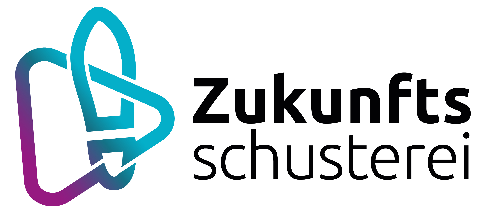
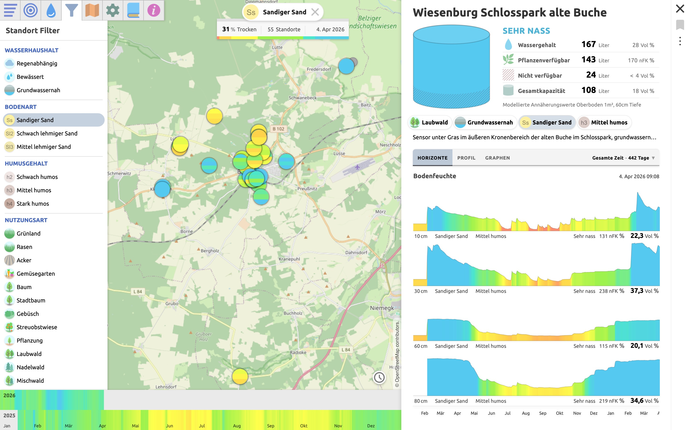

# Wasserkarte

Interaktive Datenkarte zur Visualisierung von Bodenfeuchte-Sensordaten.

Live-Version: [wasserkarte.org](https://wasserkarte.org)

## Über das Projekt

Die [Wassermeisterei](https://wassermeisterei.org) ist ein Citizen-Science-Projekt im Hohen Fläming. In der trockensten Region Deutschlands stellen Bürger*innen Bodenfeuchte-Sensoren auf und sammeln Daten, um Böden besser zu verstehen und Strategien für eine dürre-resiliente Landschaft zu entwickeln. Diese Datenkarte dient der Visualisierung der gesammelten Bodenfeuchte-Sensordaten.

Die Umsetzung erfolgt in Zusammenarbeit zwischen dem Verein Lebendiger Lernort Arensnest und dem Smart-City-Modellprojekt der Stadt Bad Belzig [Zukunftsschusterei](https://zukunftsschusterei.de/).

Projektleitung Wassermeisterei: Daniel Diehl  
Projektleitung Zukunftsschusterei: Malte Specht   
Design und Programmierung Wasserkarte: [Nikolaus Baumgarten](https://nikkki.net)  

<a href="https://zukunftsschusterei.de">
  
</a>

## Voraussetzungen

Das Projekt setzt eine laufende ThingsBoard-Instanz mit angebundenen Bodenfeuchte-Sensoren voraus. Erwartet werden Bodenfeuchte-Messungen in den Tiefen 10cm, 30cm, 60cm, 80cm. Zusätzlich werden Standortattribute für Bodenart, Humusgehalt, Bewässerung und Grundwassereinfluss erwartet. 
Die Thingsboard-seitigen Anpassungen sind in diesem Repository hinterlegt: [Thingsboard-Repository](https://gitlab.opencode.de/bad-belzig/thingsboard-ce-klimadaten-mandanten-wasserkarte)

Die ThingsBoard-seitigen Anpassungen sind in diesem [Repository](https://gitlab.opencode.de/bad-belzig/thingsboard-ce-klimadaten-mandanten-wasserkarte) hinterlegt. 

<<<<<<< HEAD
=======

>>>>>>> 5bbe5ea (update)
Tutorials zur Sensorinstallation, Bodenbestimmung u.v.m. auf der [Wasserwissen](https://wassermeisterei.org/wasserwissen) Seite der Wassermeisterei.

## Screenshot



## Setup

Das Projekt besteht aus einem Vue-Frontend und einem PHP API-Cache, der Daten aus ThingsBoard lädt, aufbereitet und cached.

Für die lokale Entwicklung werden benötigt:

- Localhost-Webserver mit PHP 8+
- Node.js 18+
- npm

Für den Betrieb der Anwendung reicht ein Webserver mit PHP. `Node.js` und `npm` werden nur für lokale Entwicklung und Build-Prozesse benötigt.

```bash
npm install
cp api/config-sample.php api/config.php
mkdir -p api/cache
```

In `api/config.php` mindestens setzen:

- `THINGSBOARD_URL`
- `USERNAME`
- `PASSWORD`
- `REFRESH_SECRET`

`api/cache/` muss für PHP beschreibbar sein.

Der API-Cache nutzt `curl` für Requests an ThingsBoard und `zlib` zum komprimieren der Cache-Dateien.

Der Dev-Server erwartet lokal diese Struktur:

```text
http://localhost/wasserkarte/
http://localhost/wasserkarte/api/
```

`vite.config.js` proxyt `/api` standardmäßig an `http://localhost/wasserkarte/api/`. Das sollte in der Entwicklung aktiv bleiben, weil Vite PHP-Dateien nicht ausführt.

Vor dem ersten Start die Cache-Dateien erzeugen:

```bash
php api/lasttelemetry.php
php api/dailyaverages.php
```

Dev-Server starten:

```bash
npm start
```

Build:

```bash
npm run build
```

Folgende Cronjobs sind für den laufenden Betrieb notwendig. Ohne sie werden die Cache-Dateien nicht aktuell erzeugt. Die Anwendung stellt standartmäßig nur durch diese Skripte aufbereitete Daten dar.

```cron
0 */2 * * * /usr/bin/php /pfad/zum/projekt/api/lasttelemetry.php >> $HOME/wasserkarte.log 2>&1
5 0 * * * /usr/bin/php /pfad/zum/projekt/api/dailyaverages.php >> $HOME/wasserkarte.log
```

`api/lasttelemetry.php` aktualisiert Gerätedaten und letzte Messwerte, sollte alle zwei Stunden ausgeführt werden.

`api/dailyaverages.php` erzeugt tägliche aggregierte Zeitreihen. Sollte täglich nach Mitternacht ausgeführt werden.

## Haftungsausschluss

Dieses Projekt wird als Open-Source-Software veröffentlicht. Die Bereitstellung erfolgt ohne Gewährleistung oder Zusicherung irgendeiner Art, soweit gesetzlich zulässig.

Insbesondere wird keine Gewähr für Funktionsfähigkeit, Eignung für einen bestimmten Zweck, Fehlerfreiheit, Kompatibilität, Verfügbarkeit oder Sicherheit übernommen. Die Nutzung, Einbindung, Veränderung und Weiterverbreitung der Software erfolgt auf eigene Verantwortung.

Soweit gesetzlich zulässig, wird keine Haftung für direkte oder indirekte Schäden, Datenverluste, Ausfälle oder sonstige Folgen übernommen, die aus der Nutzung der Software oder der Unmöglichkeit ihrer Nutzung entstehen.

## Lizenz

Copyright 2026 Nikolaus Baumgarten

GNU General Public License, Version 3 or later (`GPL-3.0-or-later`). Details in [`LICENSE`](./LICENSE).

Lizenzinformationen zu verwendeten Bibliotheken liegen unter public/lizenzen/lizenzen.txt.

Hinweis: Die GPL gewährt keine Markenrechte. Namen, Logos, Förderkennzeichen und sonstige geschützte Kennzeichen sollten vor einer öffentlichen Veröffentlichung separat geprüft werden.
