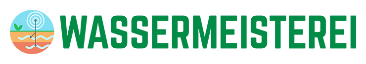

# Wasserkarte

Interaktive Datenkarte der Wassermeisterei zur Visualisierung von Bodenfeuchte-Sensordaten.

Live-Version: [wasserkarte.org](https://wasserkarte.org)

## Über das Projekt

Die [Wassermeisterei](https://wassermeisterei.org) ist ein Citizen-Science-Projekt im Hohen Fläming. In der trockensten Region Deutschlands stellen Bürger*innen Bodenfeuchte-Sensoren auf und sammeln Daten, um Böden besser zu verstehen und Strategien für eine dürre-resiliente Landschaft zu entwickeln.

Die Umsetzung erfolgt in Zusammenarbeit zwischen dem Verein Lebendiger Lernort Arensnest und dem Smart-City-Modellprojekt der Stadt Bad Belzig [Zukunftsschusterei](https://zukunftsschusterei.de/).

Projektleitung Wassermeisterei: Daniel Diehl  
Projektleitung Zukunftsschusterei: Malte Specht   
Design und Programmierung Wasserkarte: [Nikolaus Baumgarten](https://nikkki.net)  

<a href="https://zukunftsschusterei.de">
  
</a>

<a href="https://wassermeisterei.org">
  
</a>


## Voraussetzungen

Das Projekt setzt eine laufende ThingsBoard-Instanz mit angebundenen Bodenfeuchte-Sensoren voraus.

Erwartet werden Bodenfeuchte-Messungen in den Tiefen 10cm, 30cm, 60cm, 80cm.

Zusätzlich werden Standortattribute für Bodenart, Humusgehalt, Bewässerung und Grundwassereinfluss erwartet. 

Tutorials zur Sensorinstallation, Bodenbestimmung u.v.m. auf der [Wasserwissen](https://wassermeisterei.org/wasserwissen) Seite der Wassermeisterei.

## Screenshots


## Setup

Das Projekt besteht aus einem Vue-Frontend und einem PHP API-Cache, der Daten aus ThingsBoard lädt, aufbereitet und cached.

Für die lokale Entwicklung werden benoetigt:

- Localhost-Webserver mit PHP 8+
- Node.js 18+
- npm

Für den Betrieb der Anwendung reicht ein Webserver mit PHP. `Node.js` und `npm` werden nur für lokale Entwicklung und Build-Prozesse benoetigt.

```bash
npm install
cp api/config-sample.php api/config.php
mkdir -p api/cache
```

In `api/config.php` mindestens setzen:

- `THINGSBOARD_URL`
- `USERNAME`
- `PASSWORD`
- `REFRESH_SECRET`

`api/cache/` muss für PHP beschreibbar sein.

Der API-Cache nutzt `curl` für Requests an ThingsBoard und `zlib` für die komprimierten Cache-Dateien.

Der Dev-Server erwartet lokal diese Struktur:

```text
http://localhost/wasserkarte/
http://localhost/wasserkarte/api/
```

`vite.config.js` proxyt `/api` standardmaessig an `http://localhost/wasserkarte/api/`. Das sollte in der Entwicklung aktiv bleiben, weil Vite PHP-Dateien nicht ausfuehrt.

Vor dem ersten Start die Cache-Dateien erzeugen:

```bash
php api/lasttelemetry.php
php api/dailyaverages.php
```

Dann den Dev-Server starten:

```bash
npm start
```

Build:

```bash
npm run build
npm run serve
```

## Wichtige Cronjobs

Die Cronjobs sind für den produktiven Betrieb notwendig. Ohne sie werden die Cache-Dateien nicht aktuell erzeugt, und die Anwendung lädt unvollständig oder veraltet.

```cron
0 */2 * * * /usr/bin/php /pfad/zum/projekt/api/lasttelemetry.php >> $HOME/wasserkarte.log 2>&1
5 0 * * * /usr/bin/php /pfad/zum/projekt/api/dailyaverages.php >> $HOME/wasserkarte.log
```

`api/lasttelemetry.php` aktualisiert Gerätedaten und letzte Messwerte, sollte mindestens alle zwei Stunden ausgeführt werden

`api/dailyaverages.php` erzeugt tägliche aggregierte Zeitreihen und die komprimierten Gesamt-Caches. Sollte täglich kurz nach Mitternacht ausgeführt werden.

## Lizenz

Apache License 2.0. Details in [`LICENSE`](./LICENSE).

Lizenzinformationen zu verwendeten Bibliotheken liegen unter public/lizenzen/lizenzen.txt.

Hinweis: Die Apache-Lizenz gewaehrt keine Markenrechte. Namen, Logos, Foerderkennzeichen und sonstige geschuetzte Kennzeichen sollten vor einer oeffentlichen Veroeffentlichung separat geprueft werden.