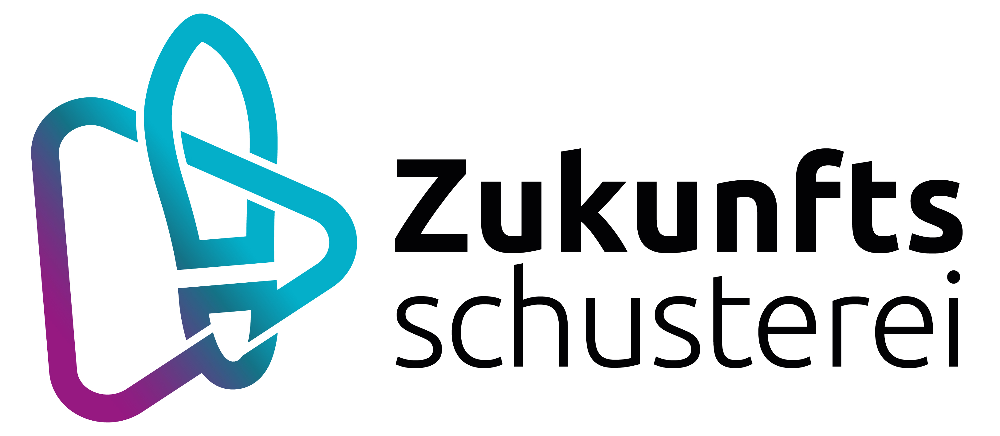
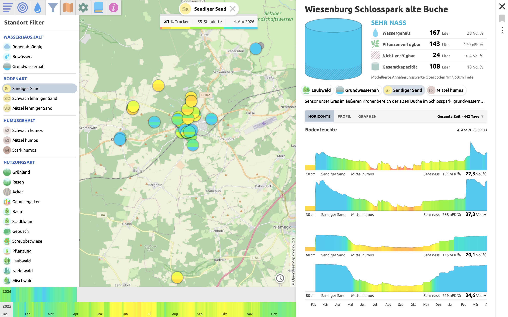

# Wasserkarte

Interaktive Datenkarte zur Visualisierung von Bodenfeuchte-Sensordaten.

Live-Version: [wasserkarte.org](https://wasserkarte.org)

## Über das Projekt

Die [Wassermeisterei](https://wassermeisterei.org) ist ein Citizen-Science-Projekt im Hohen Fläming. In der trockensten Region Deutschlands stellen Bürger*innen Bodenfeuchte-Sensoren auf und sammeln Daten, um Böden besser zu verstehen und Strategien für eine dürre-resiliente Landschaft zu entwickeln. Diese Datenkarte dient der Visualisierung der gesammelten Bodenfeuchte-Sensordaten.

Die Umsetzung erfolgt in Zusammenarbeit zwischen dem Verein Lebendiger Lernort Arensnest und dem Smart-City-Modellprojekt der Stadt Bad Belzig [Zukunftsschusterei](https://zukunftsschusterei.de/).

Projektleitung Wassermeisterei: Daniel Diehl  
Projektleitung Zukunftsschusterei: Malte Specht   
Design und Programmierung Wasserkarte: [Nikolaus Baumgarten](https://nikkki.net)  

<a href="https://zukunftsschusterei.de">
  
</a>

## Voraussetzungen

Das Projekt setzt eine laufende ThingsBoard-Instanz mit angebundenen Bodenfeuchte-Sensoren voraus. Erwartet werden Bodenfeuchte-Messungen in den Tiefen 10cm, 30cm, 60cm, 80cm. Zusätzlich werden Standortattribute für Bodenart, Humusgehalt, Bewässerung und Grundwassereinfluss erwartet.

Die ThingsBoard-seitigen Anpassungen sind in diesem [Repository](https://gitlab.opencode.de/bad-belzig/thingsboard-ce-klimadaten-mandanten-wasserkarte) hinterlegt. 

Tutorials zur Sensorinstallation, Bodenbestimmung u.v.m. auf der [Wasserwissen](https://wassermeisterei.org/wasserwissen) Seite der Wassermeisterei.

## Screenshot



## Setup

Das Projekt besteht aus einem Vue-Frontend und einem PHP API-Cache, der Daten aus ThingsBoard lädt, aufbereitet und cached.

Für die lokale Entwicklung werden benötigt:

- Localhost-Webserver mit PHP 8+
- Node.js 18+
- npm

Für den Betrieb der Anwendung reicht ein Webserver mit PHP. `Node.js` und `npm` werden nur für lokale Entwicklung und Build-Prozesse benötigt.

```bash
npm install
cp api/config-sample.php api/config.php
mkdir -p api/cache
```

In `api/config.php` mindestens setzen:

- `THINGSBOARD_URL`
- `USERNAME`
- `PASSWORD`
- `REFRESH_SECRET`

`api/cache/` und `api/storage/` müssen für PHP beschreibbar sein. `api/storage/`
enthält dauerhafte Nutzerdaten und darf beim Leeren des Caches nicht entfernt werden.

Für lokale Post-Tests in `api/config.php` `POSTS_LOCAL_MODE` auf `true` setzen.
Neue Posts erhalten dann `environment: "local"`; lokal werden auch Produktionsposts
angezeigt, sind aber lokal nur lesbar. In Produktion bleibt die Option `false` (Standard bei fehlender Option):
lokale Posts werden weder ausgeliefert noch zur Bearbeitung oder Löschung angeboten.
Produktionsposts haben keine Umgebungskennung. Bearbeiten erhält die bestehende
Kennzeichnung. Alte Post-Caches und Caches einer anderen Umgebung werden beim
nächsten Zugriff einmalig aus ThingsBoard neu aufgebaut.

Der API-Cache nutzt `curl` für Requests an ThingsBoard und `zlib` zum komprimieren der Cache-Dateien.

Der Dev-Server erwartet lokal diese Struktur:

```text
http://localhost/wasserkarte/
http://localhost/wasserkarte/api/
```

`vite.config.js` proxyt `/api` standardmäßig an `http://localhost/wasserkarte/api/`. Das sollte in der Entwicklung aktiv bleiben, weil Vite PHP-Dateien nicht ausführt.

Vor dem ersten Start die Cache-Dateien erzeugen:

```bash
php api/telemetry/lasttelemetry.php
php api/telemetry/dailyaverages.php
```

Wenn die Produktionsdaten bereits per FTP erreichbar sind, können die aktuellen
Aggregationen stattdessen mit `npm run pulldata` nach `api/cache/` geladen werden.
Das Skript verwendet dieselben `FTP_*`-Variablen aus `.env` wie `kartedist`, lädt
`alltelemetry.json`, `alltelemetry.json.gz`, `devices.json`, `devices.json.gz` und
`posts.json` direkt nach `api/cache/`. Zusätzlich werden der Produktions-Medienindex
und die zwei Bildvarianten veröffentlichter Posts nach `api/storage/` geladen.
Lokale Uploads unter `api/storage/local/` werden dabei nicht verändert.
Fehlt der Medienindex auf dem Produktionsserver noch, überspringt das Skript den
Medien-Download. Bei einem fehlgeschlagenen Bild-Download bleibt der bisherige
Medienindex erhalten. `pulldata` ist ein lokaler Entwicklungshelfer und darf nicht
auf dem Produktionsserver ausgeführt werden.

### Bilder an Posts

Im Post-Dialog können bis zu zehn Bilder angehängt werden (JPEG, PNG oder WebP,
jeweils maximal 10 MB und 24 Megapixel; bei wenig PHP-Arbeitsspeicher kann die
zulässige Pixelzahl niedriger sein). Text ist bei einem Post mit Bildern optional.
Uploads zeigen Vorschau, Fortschritt und Wiederholungsmöglichkeit. Entfernen
bestehender Anhänge wird erst beim Speichern übernommen. Die Bildansicht lässt
sich per Escape schließen und per Pfeiltasten durchblättern.

PHP benötigt `gd` mit JPEG-, PNG- und WebP-Unterstützung sowie `fileinfo`. Für
automatische JPEG-Ausrichtung außerdem `exif`. Auf dem Server `upload_max_filesize`
auf mindestens `10M`, `post_max_size` beispielsweise auf `12M` und ein ausreichendes
`memory_limit` setzen. Frontend und API nutzen dieselbe Session und CSRF-Prüfung.
Uploadrechte entsprechen den Standort-/Postrechten. Pro Nutzer gelten zusätzlich
40 Uploads pro Stunde und eine Grenze von 200 MB für die gespeicherten Bildvarianten.

Die API erzeugt WebP-Anzeigebilder mit längster Seite maximal 2000 px und
Thumbnails mit längster Seite maximal 300 px. Seitenverhältnis bleibt erhalten,
kleine Bilder werden nicht vergrößert. Originale und EXIF-/GPS-Metadaten werden
nicht aufbewahrt. Super-Wassermeister*innen und Admins können alternativ genau ein MP4-Video bis
100 MB hochladen. Fotos und Videos dürfen nicht kombiniert werden; Frontend und
API prüfen diese Regel. Unterstützt werden H.264-Videos mit AAC-Ton oder ohne Ton.
Ohne FFmpeg findet keine Konvertierung statt: Das Originalvideo einschließlich
seiner Metadaten wird gespeichert. HEVC/MOV/WebM werden nicht unterstützt.
Der Browser erzeugt ein Vorschaubild, das die API als WebP neu kodiert.
Videos verwenden `type: "video"`, eine MP4-Anzeigevariante und ein WebP-Thumbnail.
Die Auslieferung unterstützt HTTP-Range-Anfragen; veröffentlichte Videos sind
wie Fotos sichtbar. Videos erscheinen direkt im Post als HTML-Player über die gesamte Breite, mit
nativen Controls ohne Autoplay.
Für Videos `upload_max_filesize` auf mindestens `100M` und `post_max_size`
beispielsweise auf `112M` erhöhen; auch ein vorgeschalteter Webserver muss
Uploads dieser Größe erlauben. Die Speicherquote bleibt 200 MB pro Nutzer.

```text
api/storage/
  media.json           # Produktionsindex bzw. heruntergeladene Produktionskopie
  display/<id>.webp
  thumbnails/<id>.webp
  local/               # nur lokale Uploads bei POSTS_LOCAL_MODE=true
    media.json
    display/<id>.webp
    thumbnails/<id>.webp
```

Die Post-Telemetrie in ThingsBoard enthält ausschließlich `mediaIds`. Der
Medienindex speichert ID, Post-/Standort-ID, Nutzer-ID, Umgebung,
Uploadzeitpunkt und die beiden Varianten mit Pfad, Größe und Abmessungen.
`GET /api/media/index.php` liefert nur veröffentlichte, zur Umgebung passende
Medien mit relativen URLs für `/api/media/file.php`. Nutzer-IDs und Speicherpfade
werden dabei nicht veröffentlicht. Die Dateiauslieferung prüft ebenfalls die
Umgebung und die aktuelle Post-Verknüpfung. Unveröffentlichte Uploads sind nicht
öffentlich abrufbar. Abgebrochene oder entfernte Uploads, die nach 24 Stunden
noch unbenutzt sind, werden nach einem erfolgreichen Posts-Neuaufbau von
`api/daily.php` bereinigt. Beim Löschen eines Posts werden seine Bilder entfernt.

Im Account-Menü öffnet **Medien** eine private Übersicht (`GET /api/media/manage.php`):
ThingsBoard-Admins (`TENANT_ADMIN`/`SYS_ADMIN`) und Super-Wassermeister*innen
sehen alle Uploads und können dort zwischen **Alle** und den eigenen Bildern
wechseln. Andere Nutzer sehen nur eigene Uploads, einschließlich unveröffentlichter
Bilder. Super-Wassermeister*innen haben in der Kartenanwendung dieselben
Medienrechte wie Admins, einschließlich Löschen fremder Bilder. Die in der
privaten Übersicht angezeigten Namen werden über die jeweilige Nutzer-ID aus
ThingsBoard geladen. Die Übersicht
wird nicht im öffentlichen Frontend-State gespeichert. Lokal werden auch
Produktionsbilder angezeigt, bleiben jedoch schreibgeschützt.

`DELETE /api/media/manage.php` mit JSON `{ "id": "…" }` erfordert Session und CSRF;
Admins dürfen alle, Nutzer nur eigene Bilder löschen. Zuerst wird die Bild-ID
aus dem aktuellen ThingsBoard-Post entfernt, danach werden Indexeintrag und
beide Bildvarianten gelöscht. Bei einem Telemetriefehler bleiben die Dateien
für einen erneuten Versuch erhalten. Posttext und andere Anhänge bleiben erhalten.
Hat der Post nach dem Entfernen weder Text noch weitere Bilder, wird auch seine
ThingsBoard-Telemetrie gelöscht und er aus dem Posts-Cache entfernt. Die Bestätigung
erfolgt über ein eigenes Modal mit Bildvorschau, erreichbar über das Drei-Punkte-Menü.
Die Medienübersicht bleibt darunter geöffnet und bedienbar; die Löschbestätigung
liegt als separates Fenster ohne Sperre oder abgedunkelten Hintergrund darüber.
`GET /api/media/manage.php?id=…` prüft dafür den aktuellen ThingsBoard-Post und
liefert die Anzahl weiterer Bilder und ob Text erhalten bleibt. Bei einem reinen
Einzelbild-Post erscheint kein Zusatzhinweis. Das Frontend sendet den mitgelieferten
`postRevision`-Fingerabdruck beim Löschen mit: Zwischenzeitliche Änderungen führen
zu HTTP 409 und einer erneuten Bestätigung statt einer Löschung auf veraltetem Stand.
Es wird kein Platzhaltertext im Post angezeigt. Nicht mehr im öffentlichen
Medienindex vorhandene Bild-IDs werden beim Anzeigen ausgelassen.

`api/storage/` enthält dauerhafte Nutzerdaten: **regelmäßig mitsamt Index
sichern, nicht als löschbaren Cache behandeln**. Build und Deployment schließen
`api/storage/` ebenso wie `api/cache/` aus. Alle Änderungen am Medienindex werden über einen
Dateilock und einen atomaren Dateiaustausch geschrieben.

Der PHP-Speicherpfad ist mit `MEDIA_STORAGE_DIR` konfigurierbar; ohne diese Option
gilt ebenfalls `api/storage/`, bestehende `config.php`-Dateien müssen also nicht
geändert werden. `pulldata` verwendet den Standardpfad lokal und auf dem Server.

Die Medienprüfungen laufen isoliert ohne echte ThingsBoard-Konfiguration:

```bash
php tests/media-test.php
php tests/media-http-test.php
php tests/video-test.php
node tests/pulldata-test.cjs
```

Der HTTP-Test startet zwei kurzlebige lokale PHP-Server. Eine simulierte
Frontend-Vorschau für Upload, Bearbeiten, Medienverwaltung und Bildansicht ist während `npm start`
unter `/tests/media-preview.html` erreichbar und wird nicht in den Build übernommen.

Dev-Server starten:

```bash
npm start
```

Build:

```bash
npm run build
```

Folgende Cronjobs sind für den laufenden Betrieb notwendig. Ohne sie werden die Cache-Dateien nicht aktuell erzeugt. Die Anwendung stellt standartmäßig nur durch diese Skripte aufbereitete Daten dar.

```cron
0 */2 * * * /usr/bin/php /pfad/zum/projekt/api/telemetry/lasttelemetry.php >> $HOME/wasserkarte.log 2>&1
5 0 * * * /usr/bin/php /pfad/zum/projekt/api/daily.php >> $HOME/wasserkarte.log 2>&1
```

`api/telemetry/lasttelemetry.php` aktualisiert Gerätedaten und letzte Messwerte, sollte alle zwei Stunden ausgeführt werden.

`api/daily.php` läuft täglich nach Mitternacht: zuerst Tagesmittelwerte über
`api/telemetry/dailyaverages.php`, anschließend vollständiger Neuaufbau von
`api/cache/posts.json` aus ThingsBoard. Der Posts-Cache wird auch neu aufgebaut,
wenn die Tagesmittelwerte für den Tag schon aktuell waren. Die lokale/produktive
Post-Filterung richtet sich weiterhin nach `POSTS_LOCAL_MODE` in `api/config.php`.
Das Skript ist nur über PHP CLI ausführbar, verhindert parallele Daily-Läufe per
Dateilock und meldet Fehler mit Exit-Code 1. Bestehende Cronjobs für
`dailyaverages.php` durch diesen gemeinsamen Einstieg ersetzen.

Posts-Cache manuell vollständig neu aufbauen:

```bash
php api/posts/refresh.php
```

Alternativ per HTTP: `/api/posts/refresh.php?secret=<REFRESH_SECRET>`.
Der HTTP-Aufruf ist mit der bestehenden Refresh-Sperre geschützt und erfordert
immer das konfigurierte Geheimnis. Bei Fehlern bleibt der vorherige Posts-Cache
erhalten. Beide Varianten verwenden die Post-Filterung der jeweiligen Umgebung.

## Haftungsausschluss

Dieses Projekt wird als Open-Source-Software veröffentlicht. Die Bereitstellung erfolgt ohne Gewährleistung oder Zusicherung irgendeiner Art, soweit gesetzlich zulässig.

Insbesondere wird keine Gewähr für Funktionsfähigkeit, Eignung für einen bestimmten Zweck, Fehlerfreiheit, Kompatibilität, Verfügbarkeit oder Sicherheit übernommen. Die Nutzung, Einbindung, Veränderung und Weiterverbreitung der Software erfolgt auf eigene Verantwortung.

Soweit gesetzlich zulässig, wird keine Haftung für direkte oder indirekte Schäden, Datenverluste, Ausfälle oder sonstige Folgen übernommen, die aus der Nutzung der Software oder der Unmöglichkeit ihrer Nutzung entstehen.

## Lizenz

Copyright 2026 Nikolaus Baumgarten

GNU General Public License, Version 3 or later (`GPL-3.0-or-later`). Details in [`LICENSE`](./LICENSE).

Lizenzinformationen zu verwendeten Bibliotheken liegen unter public/lizenzen/lizenzen.txt.

Hinweis: Die GPL gewährt keine Markenrechte. Namen, Logos, Förderkennzeichen und sonstige geschützte Kennzeichen sollten vor einer öffentlichen Veröffentlichung separat geprüft werden.
